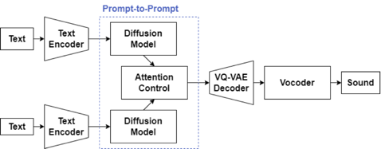

# Text-to-sound-Synthesis-Prompt2Prompt
## About


This repository includes a intuitive editing framework for text-to-sound genereation.
Edits are controlled by text, and it aims to preserve some content of the original output.
The framework is based on [prompt-to-prompt](https://github.com/google/prompt-to-prompt), and we implemented it in [Diffsound](https://github.com/yangdongchao/Text-to-sound-Synthesis).
It is tested by using a pre-trained model (please check the setup section). 


This project was created as part of the Artificial Intelligence Exercise, one of the student experiments 
in the Department of Electrical and Electronic Engineering, Department of Information and Communication Engineering, Faculty of Engineering,
The University of Tokyo.

For more information, please check the slide (in Japanese).

**Note**: Due to time constraints, development has not been completed and correct operation cannot be guaranteed.

## Contributors
- Hirota [[GitHub]](https://github.com/decfrr)
- jellyfish_rumble [[GitHub]](https://github.com/hamadatakaki)
- asterisk-cn [[GitHub]](https://github.com/asterisk-cn)


## Slide
[Slide Page](https://docs.google.com/presentation/d/1EnNYQjW6-L2cTiVhgbPEAYzG_1obout2ioEQkywnr64/edit?usp=sharing)

## Setup

1. Clone this repository
```shell
git clone https://github.com/decfrr/Text-to-sound-Synthesis-Prompt2Prompt.git
cd Text-to-sound-Synthesis-Prompt2Prompt
```
2. Create environment with Python 3.9
```shell
# For pip
pip install -r requirements.txt
# For conda (conda-forge)
conda env create -n diffsound -f requirements.yml
```
3. Download pre-trained model (**please check the following section**) and place them to `Diffsound/pre_model`
4. Start `text-to-sound.ipynb`

### Pre-trained Model

- `diffsound_audiocaps.pth`

From [Text-to-sound-Synthesis readme.md](https://github.com/yangdongchao/Text-to-sound-Synthesis/blob/master/readme.md)
> **2022/08/09** We upload trained diffsound model on audiocaps dataset, and the baseline AR model, and the codebook trained on audioset with the size of 512. You can refer to https://pan.baidu.com/s/1R9YYxECqa6Fj1t4qbdVvPQ . The password is **lsyr** <br/>
If you can not open the Baidu disk, please try to refer to PKU disk https://disk.pku.edu.cn:443/link/DA2EAC5BBBF43C9CAB37E0872E50A0E4 <br/>
More details will be updated as soon as.

Download `diffsound/diffsound_audiocaps.pth` from PKU disk.

- `last.ckpt`

From [Text-to-sound-Synthesis readme.md](https://github.com/yangdongchao/Text-to-sound-Synthesis/blob/master/readme.md)
> 2022/08/06 We uppoad the pre-trained model on google drive. please refer to 
> https://drive.google.com/drive/folders/193It90mEBDPoyLghn4kFzkugbkF_aC8v?usp=sharing

Download `Diffsound/2022-04-24T23-17-27_audioset_codebook256/checkpoints/last.ckpt` from Google Drive

- `ViT-B-32.pt`
```shell
# Require aria2
aria2c https://facevcstandard.blob.core.windows.net/t-shuygu/release_model/VQ-Diffusion/pretrained_model/ViT-B-32.pt --auto-file-renaming=false -o OUTPUT/pretrained_model/ViT-B-32.pt
```

## Reference
This project based on following open source code.
- https://github.com/XinhaoMei/ACT
- https://github.com/cientgu/VQ-Diffusion
- https://github.com/CompVis/taming-transformers
- https://github.com/lonePatient/Bert-Multi-Label-Text-Classification
- https://github.com/v-iashin/SpecVQGAN
- https://github.com/google/prompt-to-prompt
